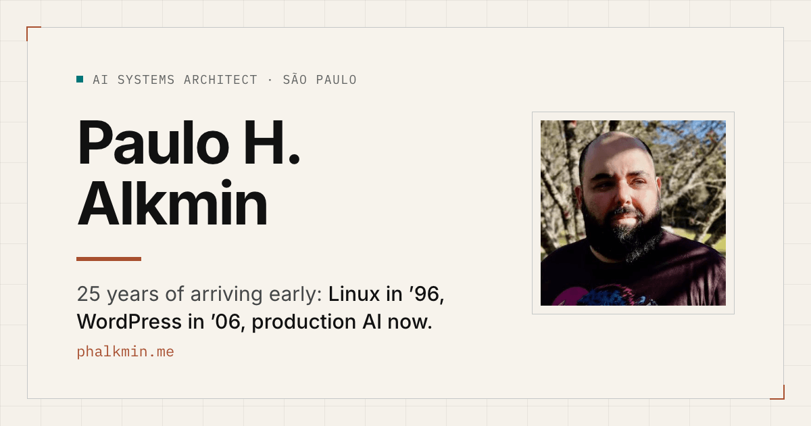

# Paulo H. Alkmin




Independent AI & WordPress consultant based in São Paulo, Brazil. I build WordPress plugins, MCP servers, RAG pipelines and n8n automations, and I care most about what happens to them after the demo.

I've worked on production systems since 2001 and built WordPress sites since 2006. Most of my work now is fitting LLMs into systems that already exist (a WooCommerce store, an editorial workflow, a support queue) without breaking the parts that already worked.

**Site:** [phalkmin.me](https://phalkmin.me/) · **Writing:** [dev.to/phalkmin](https://dev.to/phalkmin) · **LinkedIn:** [in/phalkmin](https://www.linkedin.com/in/phalkmin/)

## Open source I maintain

| Project | What it does | Where to get it |
|---|---|---|
| [**WP-AutoInsight**](https://github.com/phalkmin/WP-AutoInsight) | WordPress plugin that writes blog posts with OpenAI, Claude, Gemini or Perplexity. 6,000+ downloads on WordPress.org, where it's listed as *Automated Blog Content Creator*. | [WordPress.org](https://wordpress.org/plugins/automated-blog-content-creator/) · [Docs](https://wpautoinsight.phalkmin.me/) |
| [**ParseLess**](https://github.com/phalkmin/parseless) | Serves WordPress content as clean Markdown to AI crawlers and on `?format=md` requests, and publishes `/llms.txt`. On one page I measured, ~19,800 tokens of HTML came down to ~975 tokens of actual content. 1,200+ downloads. | [WordPress.org](https://wordpress.org/plugins/parseless/) · [Project page](https://phalkmin.me/en/parseless-wordpress-plugin/) |
| [**trendzeist-mcp**](https://github.com/phalkmin/trendzeist-mcp) | Local MCP server that gives Claude, Cursor and VS Code ranked Google Trends topics, the questions people search for, interest curves and regional demand. No API key, no account. Python, MIT. | [PyPI](https://pypi.org/project/trendzeist-mcp/) · [Project page](https://phalkmin.me/en/trendzeist-google-trends-mcp/) |

Quick try for the MCP server:

```bash
claude mcp add trendzeist -- uvx trendzeist-mcp
```

## Smaller things and challenge entries

- [**Choose Your AIdventure**](https://github.com/phalkmin/chooseyourAIdventure): a retro text RPG where Cloudflare Workers AI writes the story and draws each scene. Built for the Cloudflare AI Challenge, later revived with Gemini CLI ([play it](https://choose.phalkmin.me/)).
- [**InfogrAIphify**](https://github.com/phalkmin/InfogrAIphify): give it an article URL, get an infographic back. The original is a Python script; there's also a [Next.js + Cloudflare edition](https://github.com/phalkmin/InfogrAIphify-nodejs-edition) that runs on free models.
- [**Auty**](https://dev.to/phalkmin/meet-auty-a-bot-designed-to-support-and-guide-autistic-individuals-on-coze-l5f): a Coze bot designed to support autistic people. Won "Most Creative" in DEV's Coze AI Bot Challenge.
- [**SEO AI Toolbox**](https://seo.phalkmin.me/): six small OpenAI-powered SEO tools I started in 2023 to see what the API could actually do. Still running.
- [**customizable-konami-code**](https://github.com/phalkmin/customizable-konami-code): a WordPress plugin for hiding an easter egg behind ↑↑↓↓←→←→BA. My site has one too.

## Track record

- "Most Creative" prize, Coze AI Bot Challenge on DEV (2024)
- One of five winners of the [Built with Google Gemini Writing Challenge](https://dev.to/phalkmin/with-gemini-cli-im-able-to-keep-my-pet-projects-alive-and-kicking-2fll) on DEV (2026)
- Author of [*Samba: Windows e Linux em rede*](https://www.amazon.com.br/Samba-Windows-Linux-em-rede/dp/8561024267/) (2010), a book on Linux/Windows networking
- Nearly four years as a writer at Tecnoblog, one of Brazil's largest tech publications
- 24,000+ followers on Dev.to

## What I can help with

If one of these repos looks like the kind of problem you have, this is the paid version of it:

- [RAG systems](https://phalkmin.me/en/rag-systems-consultant/) for support bots and internal knowledge bases
- [AI architecture consulting](https://phalkmin.me/en/ai-architecture-consulting/) for teams moving an LLM feature past the prototype
- [n8n automation](https://phalkmin.me/en/n8n-automation-consulting/) for e-commerce operations
- [WordPress AI integration](https://phalkmin.me/en/wordpress-ai-integration/) and [WordPress engineering](https://phalkmin.me/en/wordpress-services/) (performance, migrations, WooCommerce)
- [Fractional CTO](https://phalkmin.me/en/fractional-cto-ai/) work when you need senior technical decisions without a full-time hire

The first step is a free 30-minute [Intro Call](https://calendly.com/phalkmin/letstalk) to see if it's a fit. If you'd rather write first, [send me your scope](https://phalkmin.me/#contact).

**Em português:** também atendo em português, com cliente no Brasil e fora dele. O site tem versão completa em [phalkmin.me/br](https://phalkmin.me/br/).

## Recent posts

<!-- BLOG-POST-LIST:START -->
<!-- BLOG-POST-LIST:END -->

---

Off the clock: I have the Platinum trophy in every Souls game, Sekiro included. If you want to argue about the hardest boss, I'm around. [Ko-fi](https://ko-fi.com/phalkmin) if any of the plugins saved you an afternoon.
